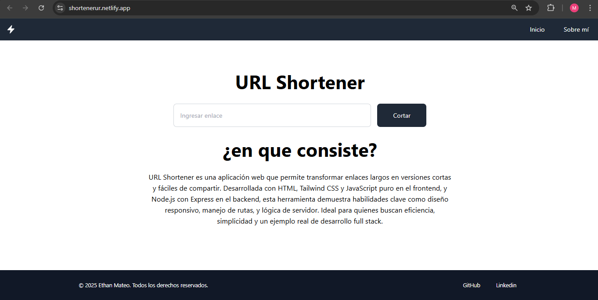

# URL Shortener

Un **acortador de enlaces** simple y funcional, desarrollado con **HTML**, **CSS**, **Javascript** y **Express**.

## Descripción

Este proyecto permite a los usuarios ingresar una URL larga y obtener un enlace corto para compartir de manera más sencilla. El objetivo principal fue construir una aplicación práctica, minimalista y fácil de usar.

- **Frontend:** HTML, CSS y JavaScript.
- **Backend:** Express.js.

## Características

- Acorta URLs largas en segundos.
- Interfaz limpia y responsiva.
- Generación automática de enlaces cortos únicos.
- Copiar el enlace acortado fácilmente.

## Deploy

Puedes probar la aplicación aquí:  
👉 [https://shortenerur.netlify.app/](https://shortenerur.netlify.app/)

## Cómo ejecutar localmente

1. Clona este repositorio:
   ```bash
   git clone https://github.com/tuusuario/tu-repo.git

2. Instala las dependencias:
   ```bash
   npm install

3. Inicia el servidor:
    ```bash
    npm start

3. Abre el navegador en:
    ```bash
    http://localhost:3000

## Tecnologías utilizadas
- HTML5
- CSS3
- JavaScript (Frontend)
- Node.js
- Express.js

```markdown


Autor: Ethan Mateo Martinez